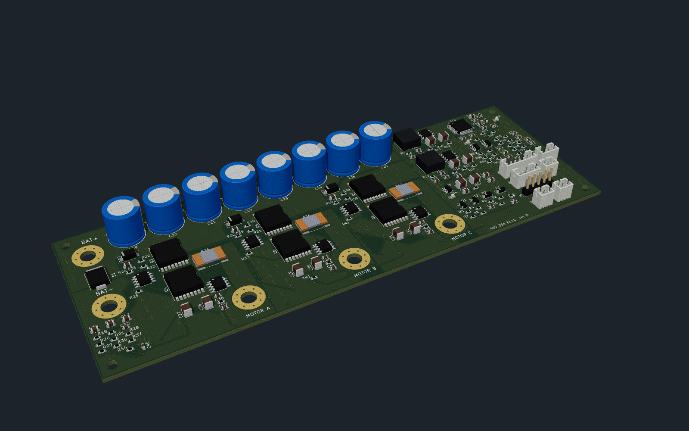
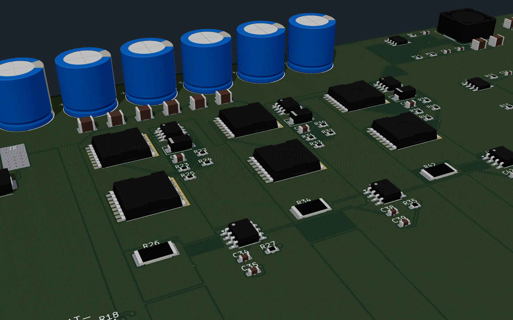
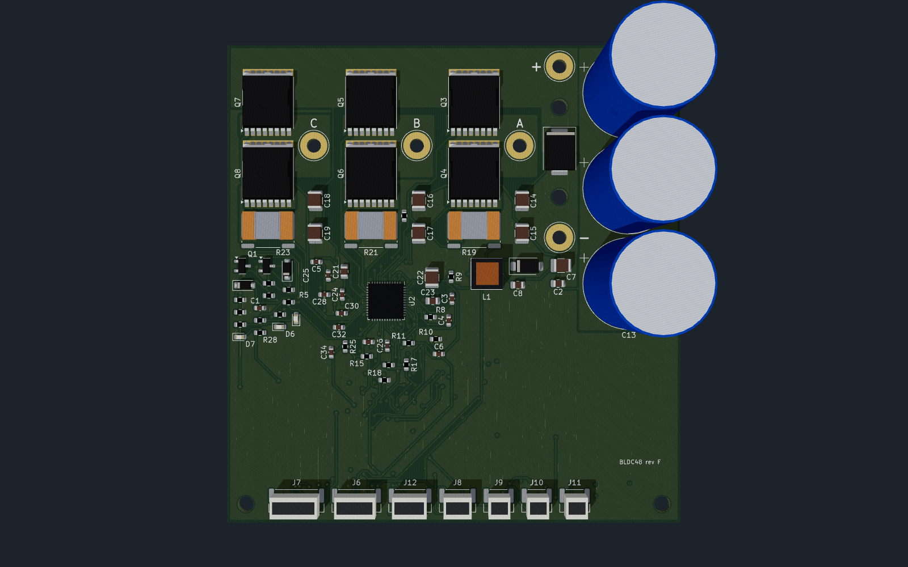
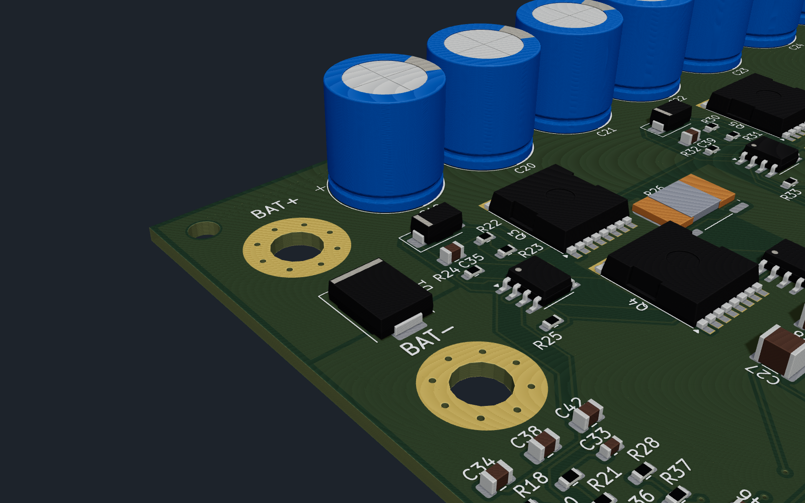
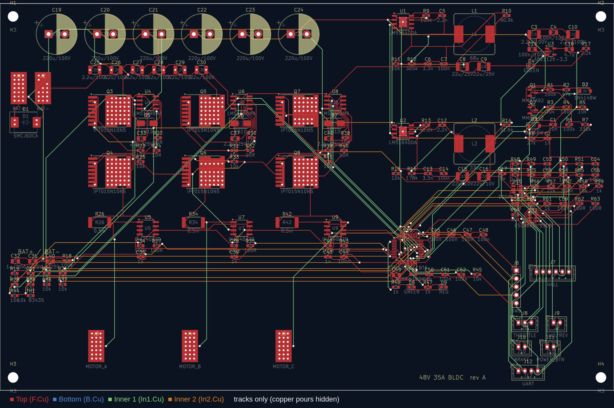

# 48 V / 35 A BLDC hub-motor controller

A KiCad hardware design plus STM32 firmware for a hall-sensored e-bike or scooter hub motor:

* **48 V nominal** (13S Li-ion, 54.6 V full). All power parts are rated 100 V and the TVS clamps at 60 V standoff.
* **35 A battery current limit** and 60 A phase current limit. Both are set in firmware and can be changed over UART.
* **Field-oriented control (FOC)** using the hall sensors, with angle interpolation, for quiet and smooth torque from standstill.
* **Throttle** input (standard 0.8–4.2 V hall throttle).
* **Momentary power button.** Press to switch on, hold for 2 s to switch off. Standby current is a few µA.
* **FWD/REV switch** input (switch to GND = reverse). There is also a **brake** input (switch to GND = cut power, optional regen).
* **UART telemetry and commands** (115200 8N1, 3.3 V). It streams every reading: voltage, currents, power, speed, temperatures, throttle, direction, faults, limits and energy used.
* **Auto-detect** measures motor R and L and learns the hall-sensor table, so any 120° hall hub motor works without setting angles by hand.

```
hardware/
  kicad/                 KiCad project (bldc48.kicad_pro): 4-sheet schematic + routed 4-layer PCB
  renders/               3D renders, routing/layer images, bldc48.glb 3D model
  bldc48-schematic.pdf   schematic as PDF
  bom.csv                bill of materials
  tools/                 circuit.py (the netlist source), generators, autorouting, connectivity checker,
                         render3d/ (VRML export + headless three.js renderer)
firmware/
  src/                   STM32G431 firmware (register-level, no HAL)
  sim/                   closed-loop PC simulation of the firmware against a hub-motor model
  cmsis/                 ST / ARM CMSIS headers (Apache-2.0)
```

> **Status — read this before building.** The schematic is complete and has been checked pin by pin (see
> [Verification](#verification)). The 90 × 95 mm (3.5 × 3.7 in) 4-layer, two-sided PCB (rev F) is **fully routed and passes KiCad
> DRC with 0 violations and 0 unconnected pads**. The power stage is placed by script around fixed columns; the signal
> routing was done by an autorouter (Freerouting), a small grid router for what it leaves open, and scripted copper
> pours, so have it reviewed before ordering. The firmware compiles and passes a detailed simulation, but it has
> **not been run on real hardware**. Bring the first board up with the current-limited procedure in
> [First power-up](#first-power-up).



---

## Block diagram

```
 BAT+ ──┬── TVS ── 3×1000µF + 6×2.2µF ──┬────────────────────────────────────┐
        │                                │  3 × half bridge (6 × IPT015N10N5) │
        │        ┌──────── DRV8353RS ────┴── GHx / GLx gate drive, SHx sense  ├── MOTOR A/B/C
        │        │  charge pump, 6-95 V buck → +5 V ── AP2112 → +3.3 V        │
        ├─Q1─────┤  3 × current-sense amp (G=20) ◄── 0.5 mΩ low-side Kelvin shunts
        │ latch  │  SPI config / fault readout, nFAULT
  PWR ──┘        └──► STM32G431CB ◄── ISENSE A/B/C, VBUS, throttle, NTCs
  button               │  ▲
              UART ◄───┘  └── halls, FWD/REV, brake, button
```

## Connectors

| Ref | Connector | Pin 1 | Pin 2 | Pin 3 | Pin 4 | Pin 5 | Pin 6 |
|---|---|---|---|---|---|---|---|
| J1 / J2 | 12 AWG solder pads (2.8 mm hole), right of the bridge | BAT+ / BAT− | | | | | |
| J3–J5 | 12 AWG solder pads, one per phase column | MOTOR A / B / C | | | | | |
| HALL | JST-GH 6 | +5 V | GND | Hall A | Hall B | Hall C | Motor NTC (optional) |
| THROTTLE | JST-GH 3 | +5 V | Signal | GND | | | |
| FWD/REV | JST-GH 2 | DIR (to GND = reverse) | GND | | | | |
| BRAKE | JST-GH 2 | BRAKE (to GND = braking) | GND | | | | |
| POWER_BTN | JST-GH 2 | PWR_SW (momentary to GND) | GND | | | | |
| UART | JST-GH 4 | +3.3 V out | TX (board → host) | RX (host → board) | GND | | |
| SWD | JST-GH 5 | +3.3 V | SWDIO | SWCLK | NRST | GND | |

All signal connectors are JST-GH (1.25 mm, latching) along the bottom edge. The power button and all signal wires
carry 3.3–5 V only, never battery voltage, so a cheap handlebar button is fine. Battery and phase wires are **12 AWG
silicone wire soldered straight into the plated pads** (strip 4 mm, push through, solder from the top; the pads are
via-stitched to the pours on all layers). Strain-relieve the wires to the case or heat plate with a cable tie so the
joints never carry the cable's weight. Put an **XT90-S anti-spark connector** and a **40 A fuse** in the battery
lead: the board has no reverse-polarity or inrush protection.

## First power-up

1. Flash the firmware over SWD (`cd firmware && make flash`).
2. Use a **bench supply at 48 V with a 2 A current limit**. Connect the UART (3.3 V USB-serial adapter at 115200 baud)
   and the halls, but leave the motor phases disconnected. Press the power button: the green LED blinks and telemetry
   lines (`$TLM,...`) appear. Type `status`. You should see vbus ≈ 48 V and `faults NOT_DETECTED`. Type `drv`:
   it should report `nFAULT=high` and zero status words (the DRV8353RS took its SPI settings).
3. Connect the motor phases (any order) and the hall connector. **Lift the wheel** so it spins freely.
4. Type `detect`. The wheel turns slowly forwards and then backwards (about 15 s total). Expected result:
   `detect OK: R = … mOhm, L = … uH, halls learned`. Type `save`.
   *(No UART cable? Hold the brake and full throttle for 3 s right after power-up, then release the throttle. Detect
   runs and saves automatically.)*
5. With the wheel still lifted, apply a little throttle. If the wheel turns the wrong way, `set dir_invert 1` then `save`.
6. Raise the supply limit (or switch to the battery) and set your limits, e.g. `set i_batt_max 35`, `set i_phase_max 60`,
   then `save`.

## UART interface

Lines end with CR or LF. Replies start with `>`. Telemetry lines start with `$TLM` (default every 100 ms;
change with `stream <ms>` or `stream off`).

```
$TLM,ms,state,faults,limits,vbus,ibus,power,ia,ib,ic,id,iq,iq_ref,erpm,rpm,mod,thr_v,thr_pct,dir,brake,hall,t_fet,t_mot,wh,ah,wh_regen
$TLM,105500,IDLE,0000,00,51.99,0.00,0.0,-0.01,0.01,-0.10,0.06,-0.00,0.00,2670,116.1,0.000,0.849,0.0,FWD,0,4,25.0,nan,10.912,0.2224,0.000
```
(Real line from the simulation: a coasting wheel at 116 rpm, 52 V, throttle at rest. `t_mot` is `nan` when no motor
NTC is enabled.)

| Command | What it does |
|---|---|
| `help` | List the commands |
| `status` | Human-readable state, faults, voltage, current, rpm, temperatures and control-loop CPU load |
| `tlm` / `hdr` | Print one telemetry line / print the column names |
| `stream <ms>` / `stream off` | Set the periodic telemetry rate, or turn it off |
| `get [name]` | Show one parameter, or all of them (including the learned hall angles) |
| `set <name> <value>` | Change a parameter in RAM |
| `save` / `defaults` | Write the config to flash / reload the defaults into RAM |
| `detect` / `detect r` / `detect l` / `detect hall` | Run auto-detect: everything, or only R, L or the hall table |
| `clear` | Clear latched faults |
| `drv` | DRV8353RS fault/status words, live and as captured at the last driver trip |
| `off` / `reboot` | Power the board off / restart the MCU |

Main parameters (`get` lists them all): `i_phase_max` 60 A, `i_batt_max` 35 A, `i_batt_regen` 5 A, `i_brake` 0 A (regen
on the brake input, off by default), `v_uv_start` 42 V / `v_uv_cut` 39 V (13S), `v_ov` 60 V, `t_fet_start` 80 °C /
`t_fet_max` 100 °C, `thr_min_v` 1.0 V / `thr_max_v` 4.0 V, `ramp_up` 100 A/s, `erpm_max` 0 (no speed limit),
`pole_pairs` 23 (only affects the rpm display), `mot_ntc_en` 0, `auto_off_min` 0.

| Fault bit (`faults` field, hex) | Meaning | Red LED blinks |
|---|---|---|
| 0x001 | overcurrent (80 A instantaneous phase-current trip) | 1 |
| 0x002 | overvoltage (> `v_ov`) | 2 |
| 0x004 | battery below `v_uv_cut` (no torque; information only) | short blink every 2 s |
| 0x008 | hall sensors invalid (000/111, e.g. unplugged) | 4 |
| 0x010 | throttle wire fault (< 0.4 V or > 4.7 V) | 5 |
| 0x020 | FET over-temperature or NTC broken | 6 |
| 0x040 | motor over-temperature (if `mot_ntc_en`) | 7 |
| 0x080 | halls not learned yet (run `detect`) | 8 |
| 0x100 | last detect failed | 9 |
| 0x200 | current-sensor offset out of range | 10 |
| 0x400 | throttle held at power-up | 11 |
| 0x800 | gate driver fault (DRV8353 nFAULT: VDS overcurrent, gate fault, UVLO, over-temperature); `drv` shows the fault words; the driver is re-initialised before it clears | 12 |

`limits` bits (why torque is reduced right now): 0x01 battery current, 0x02 phase current, 0x04 undervoltage
fold-back, 0x08 FET temperature, 0x10 motor temperature, 0x20 speed limit, 0x40 out of voltage (top speed),
0x80 stall protection.

Faults switch the gates off at once. They clear by themselves once the cause is gone and the throttle is back at
zero, so the motor can never restart while the throttle is held.

## How it works

**Power stage.** Six Infineon IPT015N10N5 (100 V, 1.5 mΩ, TOLL package) are driven directly by a TI DRV8353RS
smart gate driver (100 V, SPI). It sets the gate current itself (300 mA source / 600 mA sink, ≈100 ns edges on these
FETs), so there are no gate resistors; it adds 100 ns of its own dead time on top of the MCU's 400 ns and has a VDS
short-circuit trip (0.3 V, ≈110 A at 125 °C) behind the firmware's 80 A trip. Its SHx inputs sense each switch node
at the high-side source, right next to the gate pin. The MCU's TIM1 generates 20 kHz centre-aligned complementary
PWM (6-input mode). With the main output disabled, or with the driver asleep, all six gates are held low.

**Current sensing.** A 0.5 mΩ 4-terminal (Kelvin) shunt sits in each low-side source (Bourns CSS4J-4026R-L500F,
5 W). Its sense pads go to one of the DRV8353RS's three current-sense amplifiers (gain 20, biased to mid-rail), so full
scale is ±165 A per phase, comfortably above the 80 A hard trip (a compile-time check enforces this). The ADCs sample
while all three low-side FETs conduct, triggered by TIM1 channel 4 just before the counter peak. Above 90 % duty one
phase's low-side window is too short, so that phase's current is rebuilt from the other two (Ia + Ib + Ic = 0); the
duty is capped at 97 % so the bootstrap capacitors always recharge.

**Control.** The ADCs are triggered by the PWM timer once per period, and the injected-conversion interrupt runs the
FOC loop at 20 kHz:
- Clarke and Park transforms.
- PI current regulators on d and q, with BEMF/cross-coupling feed-forward and conditional-integration anti-windup.
- PWM delay compensation.
- Min/max SVPWM, capped at 97 % (low-side sensing needs a short low-side window; see above).

The rotor angle comes from the halls. Each hall edge gives the exact boundary angle, and between edges the angle is
extrapolated using a speed averaged over a full electrical revolution, which cancels sensor placement error. At
standstill the sector centre is used, which guarantees at least 86 % torque from the very first moment.

**Limits.**
- Throttle sets the torque (iq), with a ramp.
- Phase current limit.
- Battery current limit, from the power balance `I_bat = 1.5·vq·iq / Vbus`. In simulation it holds 34.8 A against a 35 A setting.
- Undervoltage, FET/motor temperature, speed and stall fold-backs.
- Instant 80 A hard trip and overvoltage trip.
- A direction change is only accepted once the wheel has stopped.

The motor flux linkage is learned while riding and used to re-engage smoothly at speed.

**Power latch.** When the button is pressed it pulls Q1's base (MMBTA92, 300 V PNP) low through 47 k and a diode.
Q1 enables the DRV8353RS's buck regulator. The MCU then sets PWR_HOLD, which turns on Q2 (MMBTA42) to keep Q1 on. A
BAT46W blocks the button-sense pull-up, so the latch cannot creep on through the unpowered 3.3 V rail. The buck's
enable divider also gives a ≈20 V UVLO. On shutdown the MCU first puts the gate driver to sleep, then releases the latch.

**Supplies.** The DRV8353RS's built-in 6–95 V buck (LM5008A core) makes +5 V for the halls, throttle and the
AP2112K-3.3 LDO; its 100 µH inductor is a 6 × 6 mm Bourns SRN6045TA. The gate drive comes from the DRV8353's own
charge pump (high side) and VGLS regulator (low side), so there is no 12 V rail and no separate gate-driver supply.
On power-up the firmware writes the driver's five configuration registers over SPI, reads them back and locks them;
a driver that does not answer stops the motor from starting (`drv` shows why).

## Verification

* `hardware/tools/check_netlist.py` exports KiCad's own netlist and checks that **every pin of all 133 parts** sits on
  the intended net, with no single-node nets. KiCad 7's CLI has no ERC, so this replaces it. A deliberately miswired
  pin is caught.
* KiCad DRC on the routed PCB: **0 violations, 0 unconnected pads, 0 footprint errors**, including the check that
  every footprint matches the stock KiCad library (report: `hardware/kicad/routing/drc.rpt`).
* `cd firmware && make sim` runs the **real** `motor.c`/`hall.c`/`cli.c` in closed loop against a model with:
  dead-time, PWM delay, ADC noise and offsets, 120° halls at an arbitrary offset, a 100 kg rider and a battery with
  internal resistance. It does this for two different motors. Results for motor 1:

  | Check | Result |
  |---|---|
  | Detect R / L / hall angles | 119.9 mΩ (120) / 259 µH (250) / 0.2° worst error |
  | Start from standstill, full throttle | torque ≥ 86 % of command from the first instant |
  | Peak phase current | 60.2 A (limit 60 A) |
  | Peak battery current (100 ms avg) | 34.3 A (limit 35 A) |
  | 120 A phase-short spike | hard trip, gates off within 200 µs |
  | Gate-driver fault (nFAULT) while riding | gates off within 2 PWM periods, driver re-initialised before restart |
  | High-duty current rebuild (low-side shunts) | exercised continuously at top speed, no faults |
  | Current-loop tracking | 0.47 A rms |
  | Top speed, 26″ wheel | ≈ 39 km/h (voltage limited) |
  | Coast, re-engage at speed, reverse, brake, throttle-wire break, hall unplug, low battery, overvoltage | all pass |

## Building the firmware

```
sudo apt install gcc-arm-none-eabi libnewlib-arm-none-eabi   # plus stlink-tools or openocd
cd firmware
make            # build/bldc48.elf/.bin/.hex  (~38 KB flash)
make flash      # st-flash, or: make flash-ocd
make sim        # closed-loop simulation on the PC
```

## Regenerating the hardware

The schematic, PCB and BOM are generated from `hardware/tools/circuit.py`, using symbols and footprints from the stock
KiCad libraries. After you edit the circuit, run `hardware/tools/regen.sh`. It needs KiCad ≥ 7; KiCad 8 and 9 open the
files directly.

`regen.sh` only places the parts. The board was then routed with
`hardware/tools/route_pcb.py --legacy --no-optimize --passes 30 --freerouting freerouting-1.9.0.jar`. This script:
- keeps tracks off the inner layers under the FETs, DC-link caps and shunts, and off the outer layers across the
  switch-node and low-side copper (rule areas)
- gives every GND pad outside the power stage its own via into the solid In1 plane, and puts a fixed "sense tap" via
  in each switch node next to the high-side gate pin for the DRV8353's SHx input
- routes the signals with Freerouting (headless, under `xvfb-run`)
- imports the result (KiCad 7 can only import a Specctra session from its GUI, so the script parses the file
  itself and restores any layer-change vias the router left out)
- `astar_route.py` is a small 4-layer grid router for connections Freerouting leaves open, keeping clear of the
  power copper
- adds the GND / +48V / +3V3 planes, the 35 A outer-layer pours and via arrays in the power pads, routes anything
  still cut off into its own pour, and stitches pour islands to the planes
- fills the zones and writes a DRC report

The routing session is saved in `hardware/kicad/routing/bldc48.ses` (with the DRC report next to it); `route_pcb.py
--ses ../kicad/routing/bldc48.ses` rebuilds a routed board from it, taking the part positions from the session. The
committed `bldc48.kicad_pcb` is the reference: a rebuild can differ in a few fan-out vias and then needs a DRC pass.

`hardware/tools/render3d/render.sh` exports the board to VRML with the KiCad 3D models (plus simple stand-ins for the
JST-GH connectors, the SRN6045 inductor and the DRV8353 QFN, whose models are not in the KiCad 7 library) and renders
the PNGs in `hardware/renders/` with three.js in headless Chromium; `layers.sh` makes the copper-layer images.

**Note:** regenerating overwrites placement and routing. For changes after this point, edit the board in KiCad and use
Tools → Update PCB from Schematic. The footprints are already linked to their schematic symbols for that.

### Board

| Overview | Power stage |
|---|---|
|  |  |
|  |  |

Routing (tracks only, pours hidden): 

Copper layers: [top](hardware/renders/bldc48-layer-top.png) · [inner 1, GND](hardware/renders/bldc48-layer-in1.png) ·
[inner 2, +48V/+3V3](hardware/renders/bldc48-layer-in2.png) · [bottom](hardware/renders/bldc48-layer-bottom.png)

Stackup as built: F.Cu power stage, gate drive and signals, with pours (switch nodes, low-side sources, +48V bus,
GND fill) · In1.Cu solid GND plane · In2.Cu +48V under the power stage and +3V3 fill elsewhere, plus signals ·
B.Cu the same high-current pours under the bridge, the MCU and I/O parts, and signals. The inner planes are unbroken
under the FETs, DC-link caps and shunts. 1666 track segments and 269 vias; each switch-node and low-side pour is one
unbroken piece on both outer layers (checked by script).

## Rev F: DRV8353RS, 90 × 95 mm

Rev E (180 × 69.5 mm) was still too big. Rev F redesigns the circuit around one TI DRV8353RS smart gate driver and
puts the parts on both sides of a **90 × 95 mm** board, **68 % of rev E's area** (3.5 × 3.7 in instead of
7.1 × 2.7 in).
- **One chip instead of eight.** The DRV8353RS replaces the three LM5109B gate drivers, the three INA240A1 current
  amplifiers and both LM5164 bucks: it has the gate drive (charge pump + low-side regulator, no 12 V rail), three
  current-sense amplifiers and a 6–95 V buck that makes the +5 V rail.
- **Low-side shunts.** The three 0.5 mΩ Kelvin shunts now sit in the low-side sources (the DRV8353's amplifiers are
  low-side). The firmware samples while all low-side FETs conduct and rebuilds the third current above 90 % duty.
- **Three 1000 µF / 100 V** cans (Aishi ERS1KM102M35OT, 18 × 35 mm) in a column next to the bridge, plus two 2.2 µF
  ceramics straight across each half bridge. 3000 µF is still 1.7 × rev B's 1760 µF. Cans can be bent over before
  soldering if the case is low.
- **12 AWG wires soldered straight into the board** instead of M5 bolt terminals: battery pads at the right of the
  bridge, one motor pad per phase column. JST-GH (1.25 mm, latching) for all signal connectors.
- **Two-sided assembly.** Power stage, gate driver, supply and connectors on top; MCU, its filters and the I/O
  conditioning on the bottom, outside the heat-plate area under the FETs.
- The phase columns run C-B-A from left to right, following the DRV8353's pin order, so no phase's gate drive crosses
  another's. The labels are only names: auto-detect learns the hall/phase order.
- Signal tracks 0.2 mm with 0.15 mm clearance (JLCPCB's 4-layer minimum is 0.09 mm). The +48 V and switch-node pours
  keep 0.5 mm.

Each phase is a column: high-side FET, low-side FET, shunt, two 2.2 µF ceramics and the motor wire pad on the switch
node beside the FETs. The heat plate goes under the bridge (bottom side, no parts there).

## Ordering from JLCPCB (rough cost)

These are estimates from JLCPCB's published pricing and LCSC part prices in October 2026. Upload the files to get a
real quote, because their prices change often.

| Item (order of 5 assembled boards) | Approx. |
|---|---|
| 4-layer PCB 90 × 95 mm, 1.6 mm, 2 oz outer copper, 5 pcs | $30–50 |
| PCBA setup + stencils, **two-sided** (standard PCBA: both sides placed) | ≈ $50 |
| "Extended" LCSC part loading fee, ≈ $3 per unique part type (~22 types) | ≈ $65 |
| SMT + through-hole joints (≈ 530 SMT + 6 THT per board) | ≈ $10 |
| Parts (≈ $30/board, all from LCSC; the DRV8353RS is ≈ $6, the six FETs ≈ $15) | ≈ $150 |
| Shipping (DHL / FedEx) | $20–35 |
| **Total for 5** | **≈ $325–360, about $65–72 per board** |

The five 12 AWG wire pads are left for you to solder (wires are not assembled). Choosing JLCPCB's "economic" PCBA
is not possible for a board with parts on both sides; if cost matters more than size, rev E (one-sided, 180 ×
69.5 mm) is in the git history.

Every part in the BOM has an LCSC part number or is a generic resistor/capacitor/diode/connector that LCSC stocks in
quantity, so JLCPCB can build the whole board.
- The bulk capacitors are Aishi ERS1KM102M35OT (C724666): 1000 µF/100 V, 18 × 35 mm, 7.5 mm pitch, 10 000 h at
  105 °C. Aishi's "1K" voltage code is 100 V in its own scheme ("1B" is 80 V), and LCSC lists the part as 100 V.
- Ripple: at 35 A battery current the DC link carries roughly 17 A rms, ≈ 5.7 A per can with three cans; the ceramics
  take the high-frequency part. Expect the cans to run warm in sustained hard use: watch their temperature, or lower
  `i_batt_max` / `i_phase_max`, or fit higher-ripple parts (Panasonic EEU-FC2A102, Nichicon UHE2A102).
- The shunts are Bourns CSS4J-4026R-L500F (LCSC/JLCPCB C2076423, 0.5 mΩ ±1 %, 5 W, 4-terminal). The footprint is
  KiCad's `R_Shunt_Isabellenhuette_BVR4026` (same 10.6 mm span and pad layout).
- The DRV8353RS is TI DRV8353RSRGZR (LCSC C506246), VQFN-48 7 × 7 mm with an exposed pad. Its exposed pad has a
  thermal-via array into the GND plane; ask for the vias to be tented or plugged.
- Check that every part you order has a 100 V rating where the BOM needs one: the TOLL FETs, DRV8353RS, the
  1000 µF/100 V caps, the 100 V ceramics and the SS110 diode. Do not let the assembly service substitute
  lower-voltage parts.
- Set the stackup to 2 oz outer copper. JLCPCB's cheap 4-layer offer is 1 oz.
- JLCPCB only assembles from 2 boards upward, and the setup and part-loading fees are charged once per order, so
  most of the cost of a small order is fees.
- Board size: 90 × 95 mm (3.5 × 3.7 in), 1.6 mm thick. The 1000 µF caps are the tallest parts, so the assembled
  board is about 37 mm tall (less if the caps are bent over). Four M3 holes: two in the battery strip, two in the
  bottom corners.

## Design review (rev B, kept for reference)

A full review of rev A found and fixed these problems:

| Problem in rev A | Fix in rev B |
|---|---|
| BAT+ / BAT− were 5×10 mm SMD solder pads 7.5 mm apart (≈2.5 mm copper gap), 6 mm in from the edge; SMD pads tear off under 12 AWG wire strain | M5 plated bolt terminals for ring lugs, via-stitched to the planes, on the left edge 36 mm apart, TVS between them, large BAT+/BAT− silkscreen |
| Motor pads sat 38 mm below their shunts | M5 bolt terminals on the bottom edge straight below each shunt, labelled MOTOR A/B/C |
| **Overcurrent trip could never fire**: INA240A2 (gain 50) saturated the ADC at ±66 A, below the 80 A trip | INA240A1 (gain 20, ±165 A full scale); a compile-time assert keeps the trip inside the measurable range; new simulation test trips on a 120 A spike within 200 µs |
| INA240 inputs tapped the switch-node/phase copper anywhere, so pour resistance corrupted the current reading | 4-terminal Kelvin shunt (Bourns CSS4J-4026R-L500F, 5 W) with dedicated sense pads to the amplifier |
| FET temperature sensor TH1 was in the board corner, far from the FETs | TH1 next to the middle low-side FET |
| DC-link ceramics ~32 mm from the low-side sources (large switching loop) | Ceramics directly under each low-side FET's source leads; both FETs drain-tab up so the switch node is a short gap between them |
| Low-side gate on the far side of the FET from its driver | Driver beside the FET pair, both gate pins facing it |
| Router ran signals on In2 straight under the FETs, slotting the +48V plane between the drains and the ceramics | Rule area keeps tracks off both inner layers under the FETs, ceramics and shunts |
| 10 Ω gate resistors: ≈170 ns edges, ≈2.9 W switching loss per high-side FET at 35 A | 4.7 Ω: ≈100 ns edges, ≈1.7 W |
| 6 × 220 µF carried ≈2.8 A rms ripple each | 8 × 220 µF, ≈2.1 A each |
| Pours sized from pad centres missed the TOLL drain tabs' real outline (vias in the tabs connected on one layer only) | Pours drawn from the measured pad outlines; inner planes solid-connected to the power terminals |

Checks run on rev B: every symbol pin matches its footprint pad (29 symbol/footprint pairs), every pin of all 174
parts is on its intended net, every footprint matches the stock KiCad library, KiCad DRC 0 violations, firmware
simulation passes on two motors including the new overcurrent test.

## PCB layout rules

* Use 4 layers with 2 oz outer copper. Run 35 A battery and phase paths as wide pours on two or more layers,
  stitched with many vias. Rule areas keep signal tracks off the switch-node and low-side copper on the top layer;
  do not route across them.
* Keep each half-bridge loop (high FET → low FET → 2.2 µF ceramics) as small as possible. The bulk caps sit right
  next to the bridge.
* Give the FET drain/source pads thermal-via arrays down to the bottom pours. Bolt the board to an aluminium plate or
  the case through a thermal pad under the bridge (no parts on the bottom there). At 35 A, expect roughly 6–10 W of
  losses at full load.
* Route each shunt's sense pads (pins 2/3 of the 4-terminal shunt) to the DRV8353's SPx/SNx as a pair, with the
  1 nF filter caps at the driver.
* Keep the gate-drive traces short and away from the switch nodes; the DRV8353's SHx pin senses each switch node at
  the high-side source, next to the gate pin. Use one solid ground plane, and keep the MCU and analog parts away from
  the switching nodes.
* Keep TH1 (the NTC) next to the low-side FETs, which run hottest.

## Things to double-check against datasheets before ordering

* The DRV8353RS buck (LM5008A core) component values (RT / shutdown divider, 100 µH inductor, 4.02 k / 4.02 k
  feedback divider, 8.2 k / 47 nF / 330 pF ripple injection) were chosen with the datasheet formulas but not run
  through TI WEBENCH.
* The DRV8353's gate-current setting (300 mA / 600 mA) and the gate-drive trace lengths: the longest gate trace is
  ≈ 60 mm (phase C high side). The driver's current-mode drive tolerates this, but look at the gate waveform on the
  first board and lower IDRIVE if it rings.
* The bulk capacitor ripple rating (≈ 5.7 A rms per can at 35 A battery current; see above).
* Choose `v_uv_*` for your pack. The defaults are for 13S.
